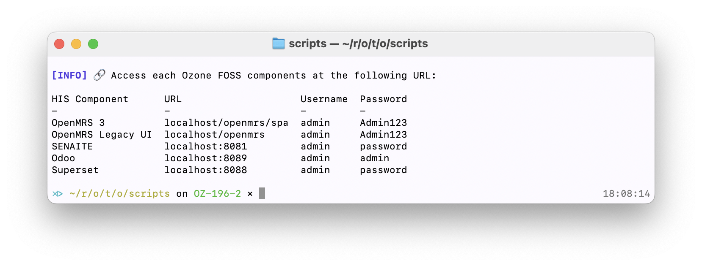

# Ozone

> The enterprise-grade health information system that augments OpenMRS 3

# Quick start

## (option 1) Try Ozone FOSS in Gitpod

[](https://gitpod.io/#https://github.com/ozone-his/ozone)

It may take some time to setup Ozone for the first time, so hang tight :hourglass_flowing_sand:

When ready Gitpod will launch the tab for OpenMRS 3.

## (option 2) Try Ozone locally using the embedded Nginx Reverse proxy

Clone
```bash
git clone https://github.com/ozone-his/ozone
cd ozone
```

Build
```bash
scripts/mvnw clean package
```

Run
```bash
source target/go-to-scripts-dir.sh
./start-demo.sh
```

Tip: After running `source target/go-to-scripts-dir.sh` command you can use `popd` to easily move back to the root directory, if needed.


## (option 3) Try Ozone locally assuming Traefik is running on the host

Clone
```bash
git clone https://github.com/ozone-his/ozone
cd ozone
```

Build
```bash
scripts/mvnw clean package
```

Run
```bash
source target/go-to-scripts-dir.sh
export TRAEFIK="true"
./start-demo.sh
```

## Browse Ozone

Once complete, the startup script will output the URLs to access the services in the terminal.

For example:

Ozone FOSS requires you to log into each component separately.

💡 **Did you know?** Ozone Pro comes with single sign-on (SSO) and all its integration layer is secured with OAuth2.

## Create Your Own Distribution

This Ozone project provides tooling to help create your own distribution. To get started, you first need to install the
archetype by running:

```bash
mvn -pl ozone-distro-archetype clean install
```

Once that's done, you can use the Maven Archetype by running:

```bash
mvn archetype:generate -DarchetypeGroupId=com.ozonehis -DarchetypeArtifactId=ozone-distro-archetype
```

This will prompt you for details about your project and create a standard Maven repository in the local directory.

**Note** You do **not** want your distribution to be part of the Ozone source code, so you should create it in a directory
that does not contain this project.
