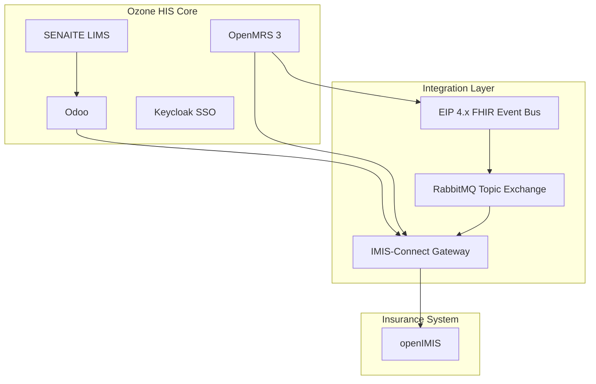
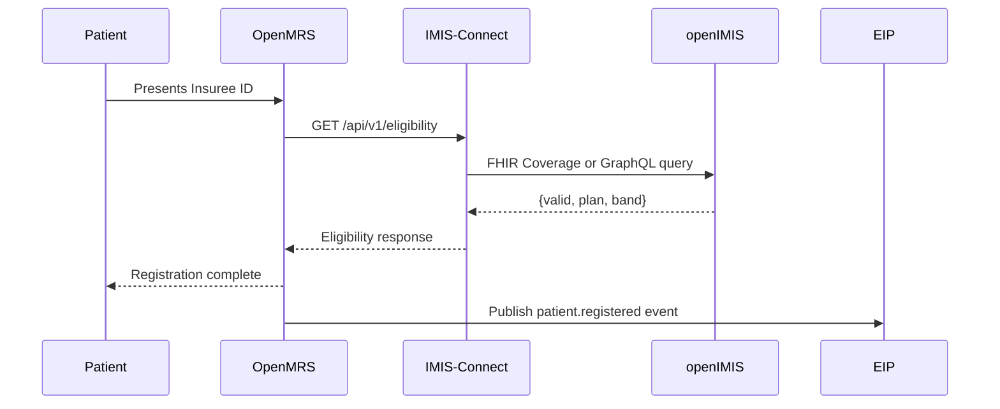
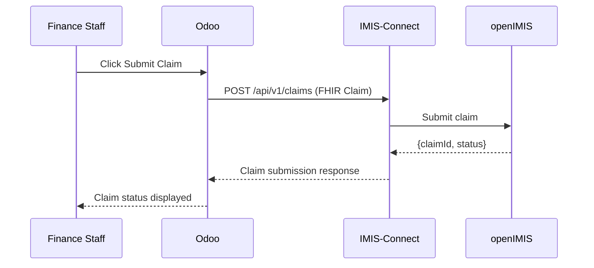

# Ozone Nigeria HMO Integration Architecture

## Overview

This document describes the architecture for integrating Ozone HIS with openIMIS for Nigeria's HMO context. The solution implements band-aware insurance claims management with support for multi-tenancy and FHIR-based integration.

## System Architecture



## Band-Aware Tariff Model

### Tariff Structure

- **Band D Tariff**: Single shared tariff table for all Band D hospitals
- **Bands A/B/C Tariff**: Facility-specific tariffs with identical service codes but varying prices per facility

### Database Schema

```sql
-- Band D Tariff (global)
CREATE TABLE tariff_band_d (
    service_code VARCHAR(50) NOT NULL,
    price_ngn DECIMAL(16,2) NOT NULL,
    effective_date DATE NOT NULL,
    PRIMARY KEY (service_code, effective_date)
);

-- Bands A/B/C Facility Tariff (facility-specific)
CREATE TABLE tariff_abc_facility (
    service_code VARCHAR(50) NOT NULL,
    band ENUM('A','B','C') NOT NULL,
    facility_uuid VARCHAR(36) NOT NULL,
    price_ngn DECIMAL(16,2) NOT NULL,
    effective_date DATE NOT NULL,
    PRIMARY KEY (service_code, band, facility_uuid, effective_date)
);
```

### Tariff Resolution Algorithm

```python
def get_price(service_code, band, facility_uuid=None):
    if band == 'D':
        price = TariffD.get(service_code)  # uniform price for all Band D hospitals
    else:
        if not facility_uuid:
            raise ValueError('Facility UUID required for Bands A/B/C')
        price = TariffABC.get(service_code, band, facility_uuid)
    
    return price
```

## Integration Flows

### Eligibility Check



### Claim Submission



## Components

### IMIS-Connect Gateway

Spring Boot microservice providing FHIR-based API:

- `/api/v1/eligibility`: Check patient insurance eligibility
- `/api/v1/claims`: Submit insurance claim
- `/api/v1/claims/{id}`: Get claim status

### Odoo Insurance Module

- **Tariff Management**: Manage Band D (global) and Bands A/B/C (facility-specific) tariffs
- **Claim Management**: Create, submit, and track claims
- **Integration**: Connect to IMIS-Connect API

### OpenMRS Configuration

- **Data Filter**: Band-based data segregation using OpenMRS Data Filter module
- **Patient Attribute**: `patient.band` attribute to store patient's insurance band
- **EIP Integration**: Publish FHIR events to RabbitMQ

## Security & Access Control

### Band Visibility Rules

| User Band | Visible Bands |
|-----------|----------------|
| A         | A, B, C, D     |
| B         | B, C, D        |
| C         | C, D           |
| D         | D              |

### Authentication

- **SSO**: Keycloak provided by Ozone HIS
- **API Security**: Service tokens for backend communication
- **Data Segregation**: OpenMRS Data Filter module

## Deployment

### Docker Compose Overlay

```yaml
services:
  rabbitmq:
    image: rabbitmq:3-management
    ports: ["5672:5672","15672:15672"]

  imis-connect:
    build:
      context: ../../
      dockerfile: infra/docker/imis-connect.Dockerfile
    depends_on: [rabbitmq]
    ports: ["8085:8080"]
```

### Local Development

```bash
# Start Ozone stack with overlay
./scripts/dev-start.sh

# Seed initial tariff data
./scripts/seed-tariffs.sh
```

## Technology Stack

- **IMIS-Connect**: Spring Boot 3.2, Java 17, Spring AMQP, HAPI FHIR
- **Message Broker**: RabbitMQ 3.13 (topic exchange)
- **Database**: PostgreSQL (existing Ozone database)
- **FHIR**: R4 with openIMIS profile support
- **Odoo**: Version specified in Ozone HIS
- **OpenMRS**: Version 3.0+

## Risks & Mitigation

1. **openIMIS FHIR Support**: Prefer FHIR; fallback to GraphQL claims if required
2. **Tariff Drift**: Keep Odoo as pricing source of truth with unitPrice in Claim
3. **Governance Fit**: Align with NHIA guidance and Kaduna openIMIS implementation

## References

- Ozone HIS: [docs.ozone-his.com](https://docs.ozone-his.com)
- EIP 4.0: [talk.openmrs.org](https://talk.openmrs.org)
- OpenMRS Data Filter: [openmrs.atlassian.net](https://openmrs.atlassian.net)
- openIMIS FHIR: [fhir.openimis.org](https://fhir.openimis.org)
- RabbitMQ: [rabbitmq.com](https://rabbitmq.com)
- SENAITE: [senaite.com](https://senaite.com)
