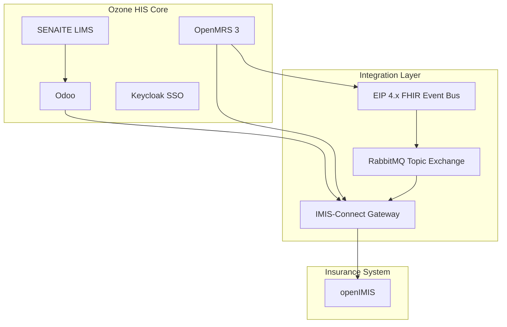
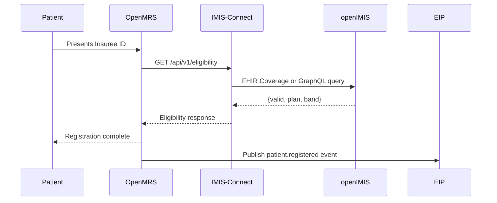
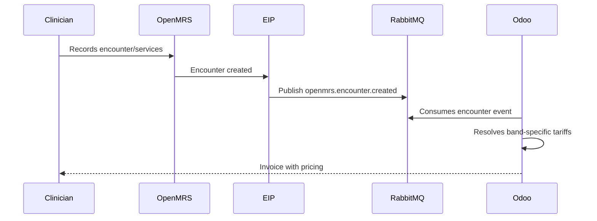
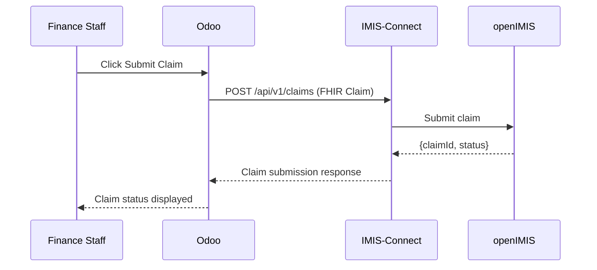

# Ozone Nigeria HMO Implementation Plan

## 1. Project Overview
This implementation extends Ozone HIS (OpenMRS 3, Odoo, SENAITE, Keycloak) with openIMIS integration specifically for Nigeria's HMO context. The solution includes band-aware tariffs, insurance eligibility checks, claim submission, and status tracking.

## 2. Architecture
The implementation follows a microservices-based architecture with an overlay approach to maintain compatibility with the upstream Ozone HIS distribution.

### 2.1 High-Level Components

### 2.2 Band-Aware Tariff Model
- **Band D**: Single shared tariff table for all Band D hospitals
- **Bands A/B/C**: Hospital-specific tariffs with identical service codes but varying prices per facility

## 3. Implementation Tasks

### 3.1 Infrastructure Setup
- Create `infra/docker/` directory
- Add `docker-compose.override.yml` to extend Ozone's existing compose
- Create `imis-connect.Dockerfile` for the insurance gateway
- Configure RabbitMQ definitions for topic exchanges and queues

### 3.2 Insurance Gateway (IMIS-Connect)
- Implement Spring Boot microservice in `services/imis-connect/`
- Create endpoints for eligibility verification, claim submission, and status tracking
- Integrate with openIMIS FHIR R4 API with GraphQL fallback
- Add RabbitMQ listener for event-driven automation

### 3.3 OpenMRS Configuration
- Create `openmrs/config/initializer/` directory
- Configure Data Filter module for band-based data segregation
- Define patient.band attribute for eligibility results
- Enable EIP FHIR event publishing to RabbitMQ

### 3.4 Odoo Module
- Implement `odoo-modules/insurance_claim/` module
- Create tariff models for Band D (global) and Bands A/B/C (facility-specific)
- Add claim management features: eligibility check, claim submission, status tracking
- Implement band-aware pricing resolution logic

### 3.5 EIP Configuration
- Create `eip/routes/` directory
- Configure Camel routes for publishing FHIR resources to RabbitMQ topics
- Set up topic routing for patient registration and encounter creation events

### 3.6 Documentation
- Create `docs/` directory with architecture overview
- Generate OpenAPI documentation for IMIS-Connect
- Create operations runbooks for claims management

### 3.7 Scripts
- Create `scripts/dev-start.sh` for local development setup
- Implement `scripts/seed-tariffs.sh` for initializing tariff data

## 4. Integration Flows

### 4.1 Eligibility & Registration

### 4.2 Encounter & Billing

### 4.3 Claim Submission

## 5. Technical Specifications

### 5.1 Technology Stack
- **IMIS-Connect**: Spring Boot 3.2, Java 17, Spring AMQP, HAPI FHIR
- **Message Broker**: RabbitMQ 3.13 (topic exchange)
- **Database**: PostgreSQL (existing Ozone database)
- **Docker**: Docker Compose for local development
- **FHIR**: R4 with openIMIS profile support

### 5.2 Band Visibility Rules
| User Band | Visible Bands |
|-----------|----------------|
| A         | A, B, C, D     |
| B         | B, C, D        |
| C         | C, D           |
| D         | D              |

### 5.3 Key Endpoints
- `POST /api/v1/eligibility`: Check patient insurance eligibility
- `POST /api/v1/claims`: Submit FHIR Claim to openIMIS
- `GET /api/v1/claims/{id}`: Get claim status and details

## 6. Testing & Validation
- Verify Ozone stack startup and basic functionality
- Test band-aware pricing resolution
- Validate insurance eligibility and claim submission flows
- Verify data segregation via OpenMRS Data Filter
- Test SENAITE integration with Odoo billing

## 7. Deployment
The solution uses Docker Compose for local development and supports Kubernetes deployment via Helm/Kustomize manifests. The integration is built as an overlay on top of the existing Ozone HIS distribution.
